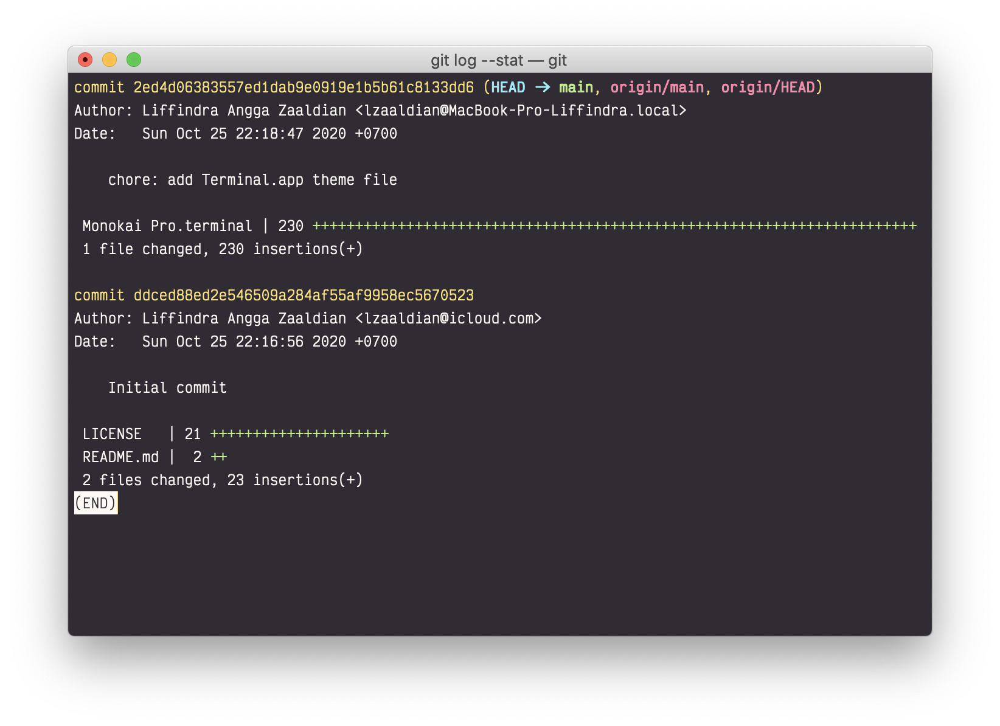

# monokai-pro--terminal-app

Monokai Pro theme for macOS Terminal.app

# How to install

1.  _Terminal > Profiles Tab_
2.  Click _"Gear" icon_
3.  Click _Import..._
4.  Select the `Monokai Pro.terminal` file
5.  Click _Default_
